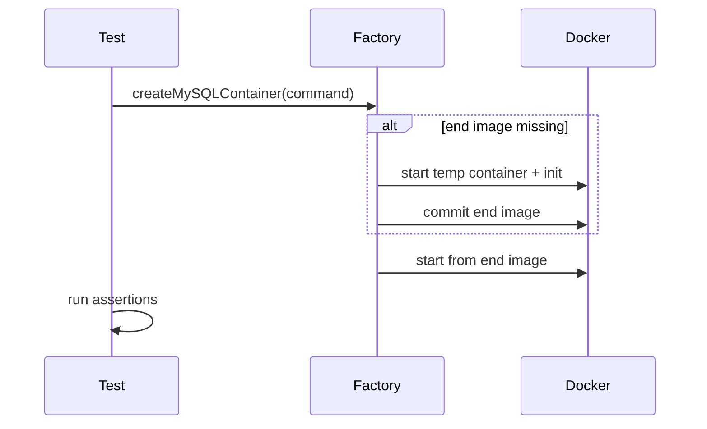
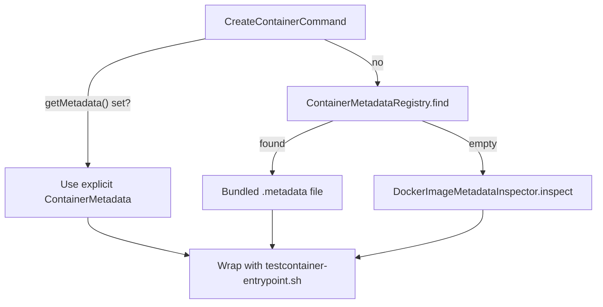

# preinit-testcontainers

[](LICENSE)
[](build-logic/src/main/groovy/preinit.testcontainers.publishing.gradle)

Faster [Testcontainers](https://java.testcontainers.org/) integration tests by baking initialization into local Docker images.

**Repository:** [github.com/sviatoslav1989/preinit-testcontainers](https://github.com/sviatoslav1989/preinit-testcontainers)

## What and why

Testcontainers starts fresh containers on every test run. Each cold start pays a high cost: image pull, process boot, and initialization (SQL scripts, migrations, custom setup).

**preinit-testcontainers** addresses initialization by:

- On first use, starting a **temporary** container, running your init (JDBC scripts, [`PreInitStartCallback`](core/src/main/java/by/macmonitor/preinittestcontainers/PreInitStartCallback.java), etc.), then **committing** a local end image with a deterministic name ([hash of config](#end-image-naming)).
- On later starts, using that baked image instead of cold-starting from upstream.
- Using a bundled entrypoint ([`testcontainer-entrypoint.sh`](core/src/main/resources/docker/testcontainer-entrypoint.sh)) with **tmpfs snapshot/restore** so mutable data dirs (e.g. MySQL `/var/lib/mysql`) stay fast while reflecting pre-baked state.
- Using **cross-process file locking** so parallel test workers do not rebuild the same image twice.

**When to use it:**

- Integration tests with heavy DB bootstrap (SQL init scripts, custom server flags).
- Suites where container startup dominates CI time.
- You already use Testcontainers 2.x and Docker locally/CI.

**When not to:** Ephemeral one-off containers with no init cost, or environments without Docker commit support.

## How it works

1. Build a `Create*ContainerCommand` (immutable builder).
2. First run: factory builds/commits the end image (one-time cost).
3. Test run: container starts from the end image + tmpfs restore.
4. Same API as stock Testcontainers (`start()`, JDBC URL, JUnit extension).



## Prerequisites

- **Docker** — daemon reachable; image commit supported.
- **Java 8+** — published artifacts target Java 8 bytecode.
- **Testcontainers 2.x** — library targets `[2.0.0, 3.0.0)`; align consumer BOM to `2.0.4+` for Docker 29+.
- **JUnit 5** — typical; not strictly required.

## Installation

Coordinates: `by.macmonitor` / `2.0.0-SNAPSHOT`.

While the version is `-SNAPSHOT`, add the Central snapshots repository. Use **`test`** / **`testImplementation`** scope in normal apps (`src/main` + `src/test`). The [examples](examples/) use `implementation` only because those modules are test-only sample projects.

### Maven

```xml
<repositories>
  <repository>
    <id>central-snapshots</id>
    <url>https://central.sonatype.com/repository/maven-snapshots/</url>
    <snapshots><enabled>true</enabled></snapshots>
    <releases><enabled>false</enabled></releases>
  </repository>
</repositories>

<dependencyManagement>
  <dependencies>
    <dependency>
      <groupId>org.testcontainers</groupId>
      <artifactId>testcontainers-bom</artifactId>
      <version>2.0.4</version>
      <type>pom</type>
      <scope>import</scope>
    </dependency>
  </dependencies>
</dependencyManagement>

<dependencies>
  <!-- Pick one preinit module (see Modules table) -->
  <dependency>
    <groupId>by.macmonitor</groupId>
    <artifactId>preinit-testcontainers-mysql</artifactId>
    <version>2.0.0-SNAPSHOT</version>
    <scope>test</scope>
  </dependency>
  <!-- JDBC driver for the DB module (test scope) -->
  <dependency>
    <groupId>com.mysql</groupId>
    <artifactId>mysql-connector-j</artifactId>
    <version>9.6.0</version>
    <scope>test</scope>
  </dependency>
  <dependency>
    <groupId>org.testcontainers</groupId>
    <artifactId>testcontainers-junit-jupiter</artifactId>
    <scope>test</scope>
  </dependency>
  <dependency>
    <groupId>org.junit.jupiter</groupId>
    <artifactId>junit-jupiter</artifactId>
    <scope>test</scope>
  </dependency>
</dependencies>
```

**Per-module artifacts** — swap the preinit artifact and add the matching JDBC driver where needed:

| Artifact | Extra test dependency |
|----------|----------------------|
| `preinit-testcontainers` | — |
| `preinit-testcontainers-jdbc` | your JDBC driver |
| `preinit-testcontainers-mysql` | `com.mysql:mysql-connector-j:9.6.0` |
| `preinit-testcontainers-postgresql` | `org.postgresql:postgresql:42.7.5` |
| `preinit-testcontainers-clickhouse` | `com.clickhouse:clickhouse-jdbc:0.9.8` |
| `preinit-testcontainers-redis` | — |

### Gradle

```groovy
repositories {
    mavenCentral()
    maven {
        url = uri("https://central.sonatype.com/repository/maven-snapshots/")
        mavenContent { snapshotsOnly() }
    }
}

dependencies {
    testImplementation platform("org.testcontainers:testcontainers-bom:2.0.4")
    testImplementation "by.macmonitor:preinit-testcontainers-mysql:2.0.0-SNAPSHOT"
    testImplementation "com.mysql:mysql-connector-j:9.6.0"
    testImplementation "org.testcontainers:testcontainers-junit-jupiter"
    testImplementation "org.junit.jupiter:junit-jupiter"
}
```

**Per-module artifacts:**

```groovy
// Generic / custom containers
testImplementation "by.macmonitor:preinit-testcontainers:2.0.0-SNAPSHOT"

// JDBC-backed custom modules
testImplementation "by.macmonitor:preinit-testcontainers-jdbc:2.0.0-SNAPSHOT"

// Database modules (+ JDBC driver where noted)
testImplementation "by.macmonitor:preinit-testcontainers-mysql:2.0.0-SNAPSHOT"
testImplementation "com.mysql:mysql-connector-j:9.6.0"

testImplementation "by.macmonitor:preinit-testcontainers-postgresql:2.0.0-SNAPSHOT"
testImplementation "org.postgresql:postgresql:42.7.5"

testImplementation "by.macmonitor:preinit-testcontainers-clickhouse:2.0.0-SNAPSHOT"
testImplementation "com.clickhouse:clickhouse-jdbc:0.9.8"

testImplementation "by.macmonitor:preinit-testcontainers-redis:2.0.0-SNAPSHOT"
```

Each DB module pulls its Testcontainers counterpart transitively via `api`.

## Modules

| Artifact | Use when |
|----------|----------|
| `preinit-testcontainers` | Generic images / custom containers |
| `preinit-testcontainers-jdbc` | Custom JDBC-backed modules |
| `preinit-testcontainers-mysql` | MySQL (`testcontainers-mysql`) |
| `preinit-testcontainers-postgresql` | PostgreSQL |
| `preinit-testcontainers-clickhouse` | ClickHouse |
| `preinit-testcontainers-redis` | Redis (`com.redis:testcontainers-redis`) |

## Quick start (MySQL)

```java
import by.macmonitor.preinittestcontainers.mysql.CreateMySQLContainerCommand;
import by.macmonitor.preinittestcontainers.mysql.MySQLContainerFactory;
import org.testcontainers.mysql.MySQLContainer;

import java.util.List;

CreateMySQLContainerCommand command = CreateMySQLContainerCommand.builder()
    .withBaseImageName("mysql:8.0.45")
    .withInitScripts(List.of("mysql/init.tables.sql", "mysql/init.data.sql"))
    .withDbName("testdb")
    .withUsername("user")
    .withPassword("password")
    .build();

try (MySQLContainer container = MySQLContainerFactory.createMySQLContainer(command)) {
    container.start();
    // container.getJdbcUrl(), etc.
}
```

- `preInitialized` defaults to `true` on commands.
- **First start** may be slow (image build); later starts reuse the end image.
- Init scripts live on the **test classpath** (e.g. `src/test/resources/`).

## Benchmarks

Startup time for `container.start()` until ready (measured by `TimedContainerStart`). Workload: **100 tables** with **20 rows per table** (2,000 inserts), or empty DB. Five repetitions per database; **median** reported below. Results from this repo's dev setup (WSL2/Docker); absolute numbers vary — relative speedups are the takeaway.

All scenarios use **tmpfs on the DB data directory**, comparing vanilla Testcontainers (init at startup) vs preinit (pre-baked init + tmpfs restore).

| Scenario | MySQL | PostgreSQL | ClickHouse |
|----------|------:|-----------:|-----------:|
| Vanilla + tmpfs, 100 tables | 13,613 | 3,663 | 14,256 |
| **Preinit + tmpfs, 100 tables** | **1,389** | **551** | **3,403** |
| Vanilla + tmpfs, empty | 8,593 | 1,325 | 5,576 |
| **Preinit + tmpfs, empty** | **1,445** | **451** | **2,388** |

Images: `mysql:8.0.45` (`/var/lib/mysql`), `postgres:17` (`/var/lib/postgresql/data`), `clickhouse/clickhouse-server:26.3.4.11` (`/var/lib/clickhouse`).

**Speedups (preinit vs vanilla + tmpfs):**

- **100 tables:** ~10× MySQL, ~7× PostgreSQL, ~4× ClickHouse.
- **Empty:** ~6× MySQL, ~3× PostgreSQL, ~2× ClickHouse.

Init-heavy workloads show the largest gains; empty DB still benefits from pre-baked image + tmpfs restore.

## Advanced

- **First-run cost:** The initial start builds and commits the end image. Steady-state `start()` times match the benchmark "Preinit" rows above.
- **Parallel CI:** Cross-process locking via [`ImageCreationLockService`](core/src/main/java/by/macmonitor/preinittestcontainers/ImageCreationLockService.java) is built-in; tune via [`ImageCreationLockOption`](core/src/main/java/by/macmonitor/preinittestcontainers/ImageCreationLockOption.java) if needed (see [Extension points](#extension-points)).
- **Disable pre-init:** `.withPreInitialized(false)` for stock Testcontainers behavior.
- **Spring Boot:** See [examples/spring-boot-mysql](examples/spring-boot-mysql) (BOM import, exclude Testcontainers from `spring-boot-starter-test`).
- **Building from source:** `./gradlew build` (Java 21 toolchain for dev; published JAR is Java 8).

### Metadata

**Metadata** is upstream Docker image invocation data — `ENTRYPOINT`, `CMD`, and data-directory `VOLUMES` — required to wrap the library entrypoint and configure tmpfs snapshot/restore. It is **not** Maven or project metadata.

The value type is [`ContainerMetadata`](core/src/main/java/by/macmonitor/preinittestcontainers/ContainerMetadata.java): `entrypoint`, `entrypointPath`, `cmd`, and `volumes`. [`getTmpFs()`](core/src/main/java/by/macmonitor/preinittestcontainers/ContainerMetadata.java) derives default tmpfs mounts from `volumes` (e.g. `/var/lib/mysql` for MySQL).

#### Bundled files

Database modules ship version-ranged properties files on the classpath, e.g. [`mysql.metadata`](modules/mysql/src/main/resources/preinit-testcontainers/metadata/mysql.metadata) at `preinit-testcontainers/metadata/{repo-last-segment}.metadata` (`mysql:8.0.45` → `mysql.metadata`).

```properties
record.0.startVersion=5.5
record.0.endVersion=9.7
record.0.entrypointPath=/usr/local/bin/docker-entrypoint.sh
record.0.entrypoint=docker-entrypoint.sh
record.0.cmd=mysqld
record.0.volumes=/var/lib/mysql
```

#### Resolution order

[`GenericContainerFactory.resolveMetadata`](core/src/main/java/by/macmonitor/preinittestcontainers/GenericContainerFactory.java) picks metadata in this order:

1. Explicit [`withMetadata(...)`](core/src/main/java/by/macmonitor/preinittestcontainers/CreateContainerCommandBuilder.java) on the command
2. [`ContainerMetadataRegistry.find`](core/src/main/java/by/macmonitor/preinittestcontainers/metadata/ContainerMetadataRegistry.java) — default [`FileBasedContainerMetadataRegistry`](core/src/main/java/by/macmonitor/preinittestcontainers/metadata/FileBasedContainerMetadataRegistry.java) loads bundled `.metadata` files
3. [`DockerImageMetadataInspector.inspect`](core/src/main/java/by/macmonitor/preinittestcontainers/metadata/DockerImageMetadataInspector.java) — live `docker inspect` when no bundled file matches



Version matching ([`MetadataFile.resolve`](core/src/main/java/by/macmonitor/preinittestcontainers/metadata/MetadataFile.java)): `latest` or empty tag → highest `endVersion` record; in-range tag → matching record; tag newer than max → max record; tag older than min → inspect fallback.

#### Override

For custom or unsupported images without a bundled `.metadata` file, set metadata explicitly via [`CreateContainerCommandBuilder.withMetadata`](core/src/main/java/by/macmonitor/preinittestcontainers/CreateContainerCommandBuilder.java).

### End image naming

The committed local image name is **deterministic** so identical configuration reuses the cache. Any input that changes image contents must affect the hash.

Resolution ([`GenericContainerFactory.createPreinitialized`](core/src/main/java/by/macmonitor/preinittestcontainers/GenericContainerFactory.java)):

1. Explicit [`withEndImageName(...)`](core/src/main/java/by/macmonitor/preinittestcontainers/CreateContainerCommandBuilder.java) wins
2. Otherwise [`ContainerEndImageNameCalculator.calculate`](core/src/main/java/by/macmonitor/preinittestcontainers/endimagename/ContainerEndImageNameCalculator.java) — default [`GenericContainerEndImageNameCalculator`](core/src/main/java/by/macmonitor/preinittestcontainers/endimagename/GenericContainerEndImageNameCalculator.java)

#### Default hash algorithm

**String inputs** (in order): `cmdParameters`, environment variables (`key=value`, keys sorted), `privileged=...`, `callback.uniqueKey()` when a [`PreInitStartCallback`](core/src/main/java/by/macmonitor/preinittestcontainers/PreInitStartCallback.java) is set.

**File inputs** (in order): [`docker/testcontainer-entrypoint.sh`](core/src/main/resources/docker/testcontainer-entrypoint.sh), then each `classpathResourceMapping` path — for each path, hash path bytes plus raw classpath file bytes.

**Digest:** MD5 over concatenated inputs (no delimiters between string params; `null` → literal `"null"`).

**Format:** `{prefix}-{baseImageName}.{first8HexChars}` — e.g. `test-mysql:8.0.45.a1b2c3d4` (prefix `"test"`).

#### JDBC modules

[`JdbcEndImageNameCalculator`](modules/jdbc/src/main/java/by/macmonitor/preinittestcontainers/endimagename/JdbcEndImageNameCalculator.java) extends the default: prefix = `dbName`; extra string hash of `dbName`, `username`, `password`; extra file hash of `initScripts`.

Changing init scripts, env vars, credentials, or classpath mappings produces a new image name. `preInitialized=false` does **not** affect the hash (stock path skips commit).

### Extension points

| Interface | When to use |
|-----------|-------------|
| [`ContainerFactory`](core/src/main/java/by/macmonitor/preinittestcontainers/ContainerFactory.java) | Entry point: `create(command)` |
| [`CreateContainerCommand`](core/src/main/java/by/macmonitor/preinittestcontainers/CreateContainerCommand.java) | Read-side command contract |
| [`CreateContainerCommandBuilder`](core/src/main/java/by/macmonitor/preinittestcontainers/CreateContainerCommandBuilder.java) | Fluent builder (`withBaseImageName`, `withMetadata`, `withEndImageName`, …) |
| [`PreInitStartCallback`](core/src/main/java/by/macmonitor/preinittestcontainers/PreInitStartCallback.java) | Custom init during image build |
| [`ContainerEndImageNameCalculator`](core/src/main/java/by/macmonitor/preinittestcontainers/endimagename/ContainerEndImageNameCalculator.java) | Custom hashing for new container modules |
| [`ContainerMetadataRegistry`](core/src/main/java/by/macmonitor/preinittestcontainers/metadata/ContainerMetadataRegistry.java) | Custom metadata lookup |
| [`DockerImageMetadataInspector`](core/src/main/java/by/macmonitor/preinittestcontainers/metadata/DockerImageMetadataInspector.java) | Replace live Docker inspect fallback |
| [`ImageCreationLockService`](core/src/main/java/by/macmonitor/preinittestcontainers/ImageCreationLockService.java) | Customize cross-process build locking |

[`ContainerMetadata`](core/src/main/java/by/macmonitor/preinittestcontainers/ContainerMetadata.java) is the value type for `withMetadata`. Module extension is typically done by subclassing [`GenericContainerFactory`](core/src/main/java/by/macmonitor/preinittestcontainers/GenericContainerFactory.java) and [`GenericContainerEndImageNameCalculator`](core/src/main/java/by/macmonitor/preinittestcontainers/endimagename/GenericContainerEndImageNameCalculator.java) rather than adding new interfaces under `modules/`.

## Examples and license

Runnable examples live under [examples/](examples/). From that directory:

```bash
./gradlew :example-preinit-testcontainers-mysql:test
```

Licensed under [MIT](LICENSE).
